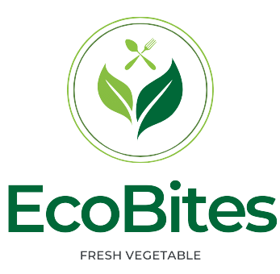

# EcoBites - Food Delivery Android Application



## 📱 Overview

EcoBites is a modern, feature-rich food delivery Android application developed as part of the PRM391 course project. The app provides users with a seamless experience to browse, order, and purchase food items with integrated payment solutions and location services.

## ✨ Key Features

### 🔐 Authentication & User Management
- **Firebase Authentication**: Secure user registration and login
- **Biometric Authentication**: Fingerprint login support for enhanced security
- **User Welcome**: Personalized greeting with user email

### 🍔 Food Browsing & Discovery
- **Category-based Browsing**: Organized food categories for easy navigation
- **Best Foods Section**: Curated list of popular and recommended items
- **Search Functionality**: Find specific dishes by name
- **Auto-scrolling Banner**: Dynamic display of featured foods
- **Detailed Food Information**: Comprehensive details including price, rating, description, and preparation time

### 🛒 Shopping Cart & Ordering
- **Smart Cart Management**: Add, remove, and modify quantities
- **Persistent Cart**: Items saved locally using TinyDB
- **Real-time Price Calculation**: Automatic total, tax, and delivery fee computation
- **Order Summary**: Complete breakdown of costs before checkout

### 💳 Payment Integration
- **ZaloPay Integration**: Secure mobile payment processing
- **MoMo Payment Support**: Alternative payment method
- **Payment Status Tracking**: Real-time payment confirmation and error handling
- **Order History**: Track payment status and order details

### 📍 Location Services
- **Google Maps Integration**: Interactive map for delivery address selection
- **Address Selection**: Choose delivery location with map interface
- **Location Permissions**: Proper handling of location access

### 🎨 Modern UI/UX
- **Material Design**: Clean, intuitive interface following Android design guidelines
- **Responsive Layouts**: Optimized for different screen sizes
- **RecyclerView Implementation**: Smooth scrolling lists and grids
- **Custom Themes**: Consistent branding and styling
- **View Binding**: Modern Android development practices

## 🏗️ Technical Architecture

### **Architecture Pattern**
- **MVP (Model-View-Presenter)**: Clean separation of concerns
- **Modular Design**: Organized code structure with separate packages

### **Project Structure**
```
app/src/main/java/com/example/prm391_project/
├── Api/                    # API integration and order management
├── Constant/              # Application constants
├── helper/                # Utility classes (ManagementCart, etc.)
├── model/                 # Data models (Foods, Category, Location, etc.)
├── presenter/             # Presentation layer (Adapters)
└── view/                  # Activities and UI components
```

### **Key Components**

#### **Models**
- `Foods`: Food item data structure with pricing, categories, and ratings
- `Category`: Food category organization
- `Location`: Delivery location management
- `Price` & `Time`: Supporting data structures

#### **Views/Activities**
- `MainActivity`: Home screen with categories and best foods
- `ListFoodsActivity`: Food listing by category or search
- `DetailActivity`: Individual food item details
- `CartActivity`: Shopping cart management
- `CheckoutActivity`: Order review and payment
- `MapActivity`: Location selection interface
- `PaymentStatusActivity`: Payment confirmation

#### **Presenters/Adapters**
- `BestFoodsPresenter`: Best foods horizontal scroll display
- `CategoryPresenter`: Category grid layout
- `FoodListPresenter`: Food items in list/grid format
- `CartPresenter`: Shopping cart items management
- `CheckoutPresenter`: Order summary display

## 🔧 Technologies & Dependencies

### **Core Android Technologies**
- **Language**: Java
- **Min SDK**: API 30 (Android 11)
- **Target SDK**: API 34 (Android 14)
- **Build System**: Gradle with Version Catalogs

### **Key Libraries & Services**

#### **Backend & Database**
```gradle
implementation 'com.google.firebase:firebase-auth:23.0.0'
implementation 'com.google.firebase:firebase-database:21.0.0'
```

#### **UI & Image Loading**
```gradle
implementation 'com.github.bumptech.glide:glide:4.16.0'
implementation 'com.google.android.material:material:1.12.0'
```

#### **Networking & JSON**
```gradle
implementation 'com.squareup.okhttp3:okhttp:4.6.0'
implementation 'com.google.code.gson:gson:2.11.0'
```

#### **Location & Maps**
```gradle
implementation 'com.google.android.gms:play-services-maps:19.0.0'
implementation 'com.google.android.gms:play-services-location:21.3.0'
```

#### **Security & Authentication**
```gradle
implementation 'androidx.biometric:biometric:1.2.0-alpha04'
implementation 'commons-codec:commons-codec:1.14'
```

## 🚀 Getting Started

### **Prerequisites**
- Android Studio Arctic Fox or later
- JDK 8 or higher
- Android SDK with API level 30+
- Google Services JSON configuration file

### **Installation Steps**

1. **Clone the Repository**
   ```bash
   git clone [repository-url]
   cd PRM391_Project
   ```

2. **Configure Firebase**
   - Add your `google-services.json` file to the `app/` directory
   - Ensure Firebase Authentication and Realtime Database are enabled

3. **API Keys Setup**
   - Add Google Maps API key to `AndroidManifest.xml`
   - Configure ZaloPay merchant credentials

4. **Build and Run**
   ```bash
   ./gradlew assembleDebug
   ```

## 📦 Application Features Breakdown

### **User Flow**
1. **Onboarding**: Intro screen with login/signup options
2. **Authentication**: Firebase-powered secure login
3. **Home**: Browse categories and featured foods
4. **Exploration**: Search and filter food items
5. **Selection**: View detailed food information
6. **Ordering**: Add items to cart with quantity control
7. **Checkout**: Review order with cost breakdown
8. **Payment**: Secure payment through ZaloPay/MoMo
9. **Confirmation**: Payment status and order tracking

### **Data Management**
- **Local Storage**: TinyDB for cart persistence
- **Remote Database**: Firebase Realtime Database for food catalog
- **Image Storage**: Glide for efficient image loading and caching
- **State Management**: Presenter pattern for UI state handling

### **Security Features**
- Firebase Authentication for secure user management
- Biometric authentication for quick access
- Secure payment processing through trusted providers
- Proper permission handling for location and device access

## 🎯 Learning Objectives (PRM391)

This project demonstrates proficiency in:
- Android application development fundamentals
- Modern Android architecture patterns (MVP)
- Firebase integration and real-time data management
- Payment gateway integration
- Location services and mapping
- UI/UX design principles
- Third-party library integration
- Security best practices in mobile development

## 🤝 Contributing

This is an educational project for the PRM391 course. Contributions and suggestions for improvements are welcome through:
- Code reviews and optimization suggestions
- UI/UX enhancement ideas
- Additional feature implementations
- Documentation improvements

## 📄 License

This project is developed for educational purposes as part of the PRM391 Mobile Programming course.

## 📞 Support

For questions related to this project, please contact the development team or course instructors.

---

**EcoBites** - Delivering fresh, sustainable food options right to your doorstep! 🌱🍽️
